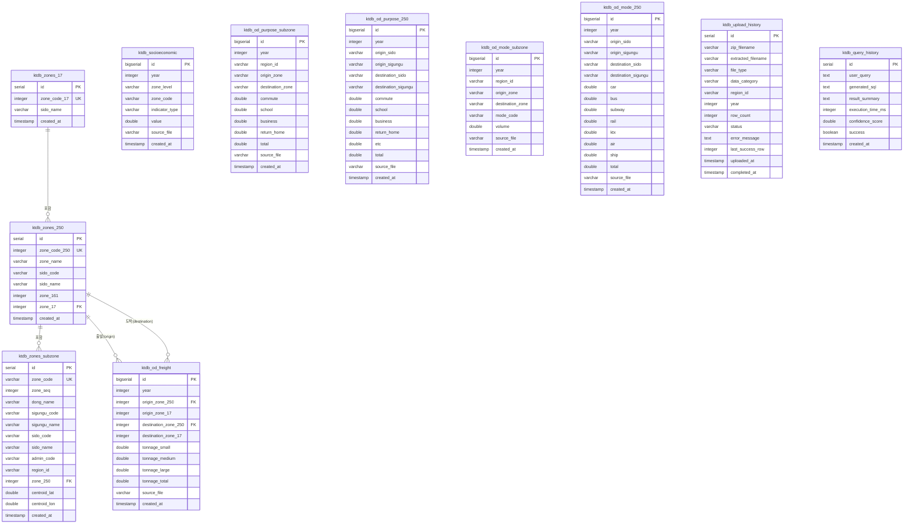

# KTDB PostgreSQL 데이터베이스 스키마 가이드

> 최종 업데이트: 2026-03-11
> 대상 DB: PostgreSQL 16
> 스키마: public

---

## 목차

1. [개요](#1-개요)
2. [ER 다이어그램](#2-er-다이어그램)
3. [존체계 (Zone System)](#3-존체계-zone-system)
4. [테이블 상세 명세](#4-테이블-상세-명세)
5. [파티션 전략](#5-파티션-전략)
6. [데이터 볼륨](#6-데이터-볼륨)
7. [인덱스 전략](#7-인덱스-전략)
8. [데이터 흐름](#8-데이터-흐름)

---

## 1. 개요

KTDB(국가교통데이터베이스) PostgreSQL DB는 국토교통부가 제공하는 전국 교통 통행량 원시 데이터를 구조화하여 저장하는 분석용 데이터베이스입니다.

### 목적
- KTDB 원본 파일(`.OUT`, `.TXT`, `.xlsx`)을 파싱 후 정형화된 관계형 구조로 영구 저장
- Text-to-SQL LLM 에이전트의 질의 대상 DB로 활용
- 연도별 수요 예측 데이터(2023~2050) 시계열 분석 지원

### 전체 구성

| 구분 | 테이블 수 | 설명 |
|------|-----------|------|
| 존 마스터 | 3개 | 17존, 250존, 소존 코드 체계 |
| OD 통행량 | 4개 (+ 파티션 14개) | 목적별/수단별/화물 OD 매트릭스 |
| 사회경제지표 | 1개 | 인구, 고용자 등 존별 지표 |
| 운영 | 2개 | 업로드 이력, 쿼리 이력 |
| **합계** | **25개** | 메인 11개 + 파티션 14개 |

---

## 2. ER 다이어그램



---

## 3. 존체계 (Zone System)

KTDB는 3단계 계층 존체계를 사용합니다.

```
17존 (광역 시도)
 └── 250존 (시군구)
      └── 소존 (행정동 / 교통존)
           ※ 3,617개 소존 → 6개 권역(region_id)으로 분류
```

### 계층 구조

| 레벨 | 테이블 | 행 수 | 단위 | 예시 |
|------|--------|-------|------|------|
| 1단계 | `ktdb_zones_17` | 17 | 광역시도 | 서울특별시, 경기도 |
| 2단계 | `ktdb_zones_250` | 250 | 시군구 | 강남구, 수원시 |
| 3단계 | `ktdb_zones_subzone` | 3,617 | 행정동/소존 | 역삼1동 (1101072) |

### 권역 코드 (region_id)

| 코드 | 권역명 | 비고 |
|------|--------|------|
| `01` | 수도권 | 서울, 인천, 경기 |
| `02` | 부산울산권 | 부산, 울산, 경남 일부 |
| `03` | 대구광역권 | 대구, 경북 일부 |
| `04` | 대전세종충청권 | 대전, 세종, 충남, 충북 |
| `05` | 광주광역권 | 광주, 전남 일부 |
| `06` | 제주권 | 제주 |
| `00` | 전국 | 250존 집계용 |

> 소존 OD 데이터는 권역 단위로 분리되어 있으며, 250존 OD는 전국 단위로 통합 제공됩니다.

---

## 4. 테이블 상세 명세

### 4.1 ktdb_zones_17 — 17존 마스터

> 시도 코드 기준 최상위 존 마스터 테이블.

| 컬럼명 | 타입 | 제약 | 설명 |
|--------|------|------|------|
| `id` | SERIAL | PK | 자동 증가 ID |
| `zone_code_17` | INTEGER | UNIQUE NOT NULL | 시도 코드 (1~17) |
| `sido_name` | VARCHAR(50) | NOT NULL | 시도명 |
| `created_at` | TIMESTAMP | DEFAULT NOW() | 등록일시 |

---

### 4.2 ktdb_zones_250 — 250존 마스터

> 시군구 단위 존 마스터. 17존과 연결되는 중간 계층.

| 컬럼명 | 타입 | 제약 | 설명 |
|--------|------|------|------|
| `id` | SERIAL | PK | 자동 증가 ID |
| `zone_code_250` | INTEGER | UNIQUE NOT NULL | 시군구 코드 (1~250) |
| `zone_name` | VARCHAR(100) | - | 시군구명 |
| `sido_code` | VARCHAR(5) | - | 시도 코드 |
| `sido_name` | VARCHAR(50) | - | 시도명 |
| `zone_161` | INTEGER | - | 161존 코드 (중간 집계 단위) |
| `zone_17` | INTEGER | FK → `ktdb_zones_17.zone_code_17` | 상위 17존 코드 |
| `created_at` | TIMESTAMP | DEFAULT NOW() | 등록일시 |

---

### 4.3 ktdb_zones_subzone — 소존 마스터

> 행정동 단위 최소 존 마스터. 권역별 OD 데이터의 존 코드 기준.

| 컬럼명 | 타입 | 제약 | 설명 |
|--------|------|------|------|
| `id` | SERIAL | PK | 자동 증가 ID |
| `zone_code` | VARCHAR(10) | UNIQUE NOT NULL | 7자리 소존 코드 (예: `1101072`) |
| `zone_seq` | INTEGER | - | 존 순번 |
| `dong_name` | VARCHAR(100) | - | 행정동명 |
| `sigungu_code` | VARCHAR(10) | - | 시군구 코드 |
| `sigungu_name` | VARCHAR(100) | - | 시군구명 |
| `sido_code` | VARCHAR(5) | - | 시도 코드 |
| `sido_name` | VARCHAR(50) | - | 시도명 |
| `admin_code` | VARCHAR(20) | - | 행정기관코드 |
| `region_id` | VARCHAR(5) | NOT NULL | 권역코드 (01~06) |
| `zone_250` | INTEGER | FK → `ktdb_zones_250.zone_code_250` | 상위 250존 코드 |
| `centroid_lat` | DOUBLE PRECISION | - | 중심점 위도 |
| `centroid_lon` | DOUBLE PRECISION | - | 중심점 경도 |
| `created_at` | TIMESTAMP | DEFAULT NOW() | 등록일시 |

**인덱스**

| 인덱스명 | 컬럼 | 목적 |
|----------|------|------|
| idx_zones_subzone_region | `region_id` | 권역별 필터링 |
| idx_zones_subzone_sigungu | `sigungu_code` | 시군구 조인 |

---

### 4.4 ktdb_socioeconomic — 사회경제지표

> 연도별·존별 인구, 고용자, 종사자, 학생 수 등 사회경제지표.

| 컬럼명 | 타입 | 제약 | 설명 |
|--------|------|------|------|
| `id` | BIGSERIAL | PK | 자동 증가 ID |
| `year` | INTEGER | NOT NULL | 연도 (2023~2050) |
| `zone_level` | VARCHAR(10) | NOT NULL | `'subzone'` 또는 `'sigungu'` |
| `zone_code` | VARCHAR(10) | NOT NULL | 존 코드 |
| `indicator_type` | VARCHAR(20) | NOT NULL | 지표 유형 (아래 참조) |
| `value` | DOUBLE PRECISION | NOT NULL | 지표 값 |
| `source_file` | VARCHAR(255) | - | 원본 파일명 |
| `created_at` | TIMESTAMP | DEFAULT NOW() | 등록일시 |

**indicator_type 값**

| 값 | 원본 파일 | 설명 |
|----|-----------|------|
| `population` | `SUB_POP{YY}.TXT` | 인구 |
| `employment` | `EMP_POP{YY}.TXT` | 고용자 수 |
| `worker` | `WORK_POP{YY}.TXT` | 종사자 수 |
| `student` | `STU_POP{YY}.TXT` | 학생 수 |

**제약 조건**

- UNIQUE(`year`, `zone_code`, `indicator_type`) — 동일 연도/존/지표 중복 불가

**인덱스**

| 인덱스명 | 컬럼 | 목적 |
|----------|------|------|
| idx_socioeconomic_year_type | `(year, indicator_type)` | 연도·지표 복합 필터 |
| idx_socioeconomic_zone | `zone_code` | 존 코드 조인 |

---

### 4.5 ktdb_od_purpose_subzone — 목적별 OD (소존, 파티션)

> 권역별 소존 단위 목적별 통행량. 연도별 RANGE 파티션 적용.
> `.OUT` 포맷 원본 파일 기반 (etc 컬럼 없음).

| 컬럼명 | 타입 | 제약 | 설명 |
|--------|------|------|------|
| `id` | BIGSERIAL | - | 자동 증가 ID |
| `year` | INTEGER | NOT NULL | 연도 (파티션 키) |
| `region_id` | VARCHAR(5) | NOT NULL | 권역코드 |
| `origin_zone` | VARCHAR(10) | NOT NULL | 출발 소존 코드 |
| `destination_zone` | VARCHAR(10) | NOT NULL | 도착 소존 코드 |
| `commute` | DOUBLE PRECISION | DEFAULT 0 | 출근 통행량 |
| `school` | DOUBLE PRECISION | DEFAULT 0 | 등교 통행량 |
| `business` | DOUBLE PRECISION | DEFAULT 0 | 업무 통행량 |
| `return_home` | DOUBLE PRECISION | DEFAULT 0 | 귀가 통행량 |
| `total` | DOUBLE PRECISION | DEFAULT 0 | 합계 통행량 |
| `source_file` | VARCHAR(255) | - | 원본 파일명 |
| `created_at` | TIMESTAMP | DEFAULT NOW() | 등록일시 |

**파티션 구성** (7개)

`ktdb_od_purpose_subzone_2023`, `_2025`, `_2030`, `_2035`, `_2040`, `_2045`, `_2050`

**제약 조건**

- UNIQUE(`year`, `region_id`, `origin_zone`, `destination_zone`)

**인덱스**

| 인덱스명 | 컬럼 | 목적 |
|----------|------|------|
| idx_od_purpose_sub_year_od | `(year, origin_zone, destination_zone)` | OD 쌍 조회 |
| idx_od_purpose_sub_year_origin | `(year, origin_zone)` | 출발지 필터 |
| idx_od_purpose_sub_year_region | `(year, region_id)` | 권역·연도 필터 |

---

### 4.6 ktdb_od_purpose_250 — 목적별 OD (250존)

> 전국 250존(시군구) 단위 목적별 통행량. `.xlsx` 원본 기반 (etc 컬럼 포함).

| 컬럼명 | 타입 | 제약 | 설명 |
|--------|------|------|------|
| `id` | BIGSERIAL | PK | 자동 증가 ID |
| `year` | INTEGER | NOT NULL | 연도 |
| `origin_sido` | VARCHAR(50) | - | 출발 시도명 |
| `origin_sigungu` | VARCHAR(100) | - | 출발 시군구명 |
| `destination_sido` | VARCHAR(50) | - | 도착 시도명 |
| `destination_sigungu` | VARCHAR(100) | - | 도착 시군구명 |
| `commute` | DOUBLE PRECISION | DEFAULT 0 | 출근 통행량 |
| `school` | DOUBLE PRECISION | DEFAULT 0 | 등교 통행량 |
| `business` | DOUBLE PRECISION | DEFAULT 0 | 업무 통행량 |
| `return_home` | DOUBLE PRECISION | DEFAULT 0 | 귀가 통행량 |
| `etc` | DOUBLE PRECISION | DEFAULT 0 | 기타 통행량 |
| `total` | DOUBLE PRECISION | DEFAULT 0 | 합계 통행량 |
| `source_file` | VARCHAR(255) | - | 원본 파일명 |
| `created_at` | TIMESTAMP | DEFAULT NOW() | 등록일시 |

**제약 조건**

- UNIQUE(`year`, `origin_sigungu`, `destination_sigungu`)

**인덱스**

| 인덱스명 | 컬럼 | 목적 |
|----------|------|------|
| idx_od_purpose_250_year_od | `(year, origin_sigungu, destination_sigungu)` | OD 쌍 조회 |

---

### 4.7 ktdb_od_mode_subzone — 수단별 OD (소존, 파티션)

> 권역별 소존 단위 교통수단별 통행량. 연도별 RANGE 파티션 적용.
> 목적별 OD와 달리 `mode_code` 컬럼으로 수단을 구분하는 **Tall 형태**.

| 컬럼명 | 타입 | 제약 | 설명 |
|--------|------|------|------|
| `id` | BIGSERIAL | - | 자동 증가 ID |
| `year` | INTEGER | NOT NULL | 연도 (파티션 키) |
| `region_id` | VARCHAR(5) | NOT NULL | 권역코드 |
| `origin_zone` | VARCHAR(10) | NOT NULL | 출발 소존 코드 |
| `destination_zone` | VARCHAR(10) | NOT NULL | 도착 소존 코드 |
| `mode_code` | VARCHAR(10) | NOT NULL | 수단 코드 (아래 참조) |
| `volume` | DOUBLE PRECISION | DEFAULT 0 | 통행량 |
| `source_file` | VARCHAR(255) | - | 원본 파일명 |
| `created_at` | TIMESTAMP | DEFAULT NOW() | 등록일시 |

**mode_code 값**

| 코드 | 수단 |
|------|------|
| `MOD01` | 승용차 |
| `MOD02` | 버스 |
| `MOD03` | 지하철/철도 |
| `MOD04` | KTX |
| `MOD05` | 항공 |
| `MOD06` | 해운 |

**파티션 구성** (7개)

`ktdb_od_mode_subzone_2023`, `_2025`, `_2030`, `_2035`, `_2040`, `_2045`, `_2050`

**제약 조건**

- UNIQUE(`year`, `region_id`, `origin_zone`, `destination_zone`, `mode_code`)

**인덱스**

| 인덱스명 | 컬럼 | 목적 |
|----------|------|------|
| idx_od_mode_sub_year_od | `(year, origin_zone, destination_zone)` | OD 쌍 조회 |
| idx_od_mode_sub_year_mode | `(year, mode_code)` | 수단별 필터 |

---

### 4.8 ktdb_od_mode_250 — 수단별 OD (250존)

> 전국 250존(시군구) 단위 교통수단별 통행량. Wide 형태(수단별 컬럼 분리).

| 컬럼명 | 타입 | 제약 | 설명 |
|--------|------|------|------|
| `id` | BIGSERIAL | PK | 자동 증가 ID |
| `year` | INTEGER | NOT NULL | 연도 |
| `origin_sido` | VARCHAR(50) | - | 출발 시도명 |
| `origin_sigungu` | VARCHAR(100) | - | 출발 시군구명 |
| `destination_sido` | VARCHAR(50) | - | 도착 시도명 |
| `destination_sigungu` | VARCHAR(100) | - | 도착 시군구명 |
| `car` | DOUBLE PRECISION | DEFAULT 0 | 승용차 통행량 |
| `bus` | DOUBLE PRECISION | DEFAULT 0 | 버스 통행량 |
| `subway` | DOUBLE PRECISION | DEFAULT 0 | 지하철 통행량 |
| `rail` | DOUBLE PRECISION | DEFAULT 0 | 철도 통행량 |
| `ktx` | DOUBLE PRECISION | DEFAULT 0 | KTX 통행량 |
| `air` | DOUBLE PRECISION | DEFAULT 0 | 항공 통행량 |
| `ship` | DOUBLE PRECISION | DEFAULT 0 | 해운 통행량 |
| `total` | DOUBLE PRECISION | DEFAULT 0 | 합계 통행량 |
| `source_file` | VARCHAR(255) | - | 원본 파일명 |
| `created_at` | TIMESTAMP | DEFAULT NOW() | 등록일시 |

**제약 조건**

- UNIQUE(`year`, `origin_sigungu`, `destination_sigungu`)

---

### 4.9 ktdb_od_freight — 화물 OD (250존)

> 전국 250존 단위 톤급별 화물 통행량. 승용차 OD와 별도 관리.

| 컬럼명 | 타입 | 제약 | 설명 |
|--------|------|------|------|
| `id` | BIGSERIAL | PK | 자동 증가 ID |
| `year` | INTEGER | NOT NULL | 연도 |
| `origin_zone_250` | INTEGER | NOT NULL, FK | 출발 250존 코드 |
| `origin_zone_17` | INTEGER | - | 출발 17존 코드 |
| `destination_zone_250` | INTEGER | NOT NULL, FK | 도착 250존 코드 |
| `destination_zone_17` | INTEGER | - | 도착 17존 코드 |
| `tonnage_small` | DOUBLE PRECISION | DEFAULT 0 | 소형 화물 통행량 |
| `tonnage_medium` | DOUBLE PRECISION | DEFAULT 0 | 중형 화물 통행량 |
| `tonnage_large` | DOUBLE PRECISION | DEFAULT 0 | 대형 화물 통행량 |
| `tonnage_total` | DOUBLE PRECISION | DEFAULT 0 | 화물 합계 통행량 |
| `source_file` | VARCHAR(255) | - | 원본 파일명 |
| `created_at` | TIMESTAMP | DEFAULT NOW() | 등록일시 |

**제약 조건**

- UNIQUE(`year`, `origin_zone_250`, `destination_zone_250`)
- FK: `origin_zone_250` → `ktdb_zones_250.zone_code_250`
- FK: `destination_zone_250` → `ktdb_zones_250.zone_code_250`

---

### 4.10 ktdb_upload_history — 업로드 이력

> 원본 파일 파싱 및 DB 적재 작업의 이력 관리. 실패/재시도 추적용.

| 컬럼명 | 타입 | 제약 | 설명 |
|--------|------|------|------|
| `id` | SERIAL | PK | 자동 증가 ID |
| `zip_filename` | VARCHAR(500) | - | 원본 ZIP 파일명 |
| `extracted_filename` | VARCHAR(500) | NOT NULL | 압축 해제 후 파일명 |
| `file_type` | VARCHAR(10) | NOT NULL | `out` / `txt` / `xlsx` |
| `data_category` | VARCHAR(50) | NOT NULL | 데이터 분류 (예: `od_purpose_subzone`) |
| `region_id` | VARCHAR(5) | - | 권역코드 |
| `year` | INTEGER | - | 데이터 연도 |
| `row_count` | INTEGER | - | 적재된 행 수 |
| `status` | VARCHAR(20) | DEFAULT `'pending'` | 처리 상태 (아래 참조) |
| `error_message` | TEXT | - | 오류 메시지 |
| `last_success_row` | INTEGER | - | 마지막 성공 행 번호 (재시도용) |
| `uploaded_at` | TIMESTAMP | DEFAULT NOW() | 작업 시작일시 |
| `completed_at` | TIMESTAMP | - | 작업 완료일시 |

**status 값**

| 값 | 의미 |
|----|------|
| `pending` | 대기 중 |
| `processing` | 처리 중 |
| `completed` | 완료 |
| `partial_success` | 부분 성공 (일부 행 적재 실패) |
| `failed` | 실패 |

---

### 4.11 ktdb_query_history — 쿼리 이력

> LLM Text-to-SQL 에이전트의 자연어 질의 및 생성 SQL 이력.

| 컬럼명 | 타입 | 제약 | 설명 |
|--------|------|------|------|
| `id` | SERIAL | PK | 자동 증가 ID |
| `user_query` | TEXT | NOT NULL | 사용자 자연어 질의 |
| `generated_sql` | TEXT | - | LLM이 생성한 SQL |
| `result_summary` | TEXT | - | 결과 요약 텍스트 |
| `execution_time_ms` | INTEGER | - | SQL 실행 시간 (ms) |
| `confidence_score` | DOUBLE PRECISION | - | LLM 신뢰도 점수 (0~1) |
| `success` | BOOLEAN | DEFAULT TRUE | 실행 성공 여부 |
| `created_at` | TIMESTAMP | DEFAULT NOW() | 질의 일시 |

---

## 5. 파티션 전략

### 대상 테이블

소존 단위 OD 테이블 2개에 **연도별 RANGE 파티션** 적용:

| 부모 테이블 | 파티션 수 | 파티션 기준 컬럼 |
|-------------|-----------|-----------------|
| `ktdb_od_purpose_subzone` | 7개 | `year` |
| `ktdb_od_mode_subzone` | 7개 | `year` |

### 파티션 테이블 목록

```
ktdb_od_purpose_subzone_2023   (year = 2023)
ktdb_od_purpose_subzone_2025   (year = 2025)
ktdb_od_purpose_subzone_2030   (year = 2030)
ktdb_od_purpose_subzone_2035   (year = 2035)
ktdb_od_purpose_subzone_2040   (year = 2040)
ktdb_od_purpose_subzone_2045   (year = 2045)
ktdb_od_purpose_subzone_2050   (year = 2050)

ktdb_od_mode_subzone_2023
ktdb_od_mode_subzone_2025
  ... (동일 패턴)
ktdb_od_mode_subzone_2050
```

### 파티션 적용 이유

| 이유 | 설명 |
|------|------|
| 데이터 규모 | 소존 OD는 21M+ 행으로 단일 테이블 시 풀스캔 부담 |
| 연도별 접근 패턴 | 분석 질의는 대부분 특정 연도 단위로 이루어짐 |
| 파티션 프루닝 | `WHERE year = 2023` 조건 시 해당 파티션만 스캔 |
| 관리 편의 | 연도별 데이터 삭제/아카이브가 파티션 단위로 가능 |

> **주의**: 쿼리 시 부모 테이블(`ktdb_od_purpose_subzone`)을 대상으로 하면 PostgreSQL이 자동으로 파티션 프루닝을 수행합니다.

---

## 6. 데이터 볼륨

| 테이블 | 행 수 | 비고 |
|--------|-------|------|
| `ktdb_zones_17` | 17 | 고정 |
| `ktdb_zones_250` | 250 | 고정 |
| `ktdb_zones_subzone` | 3,617 | 고정 |
| `ktdb_socioeconomic` | 111,188 | 4종 지표 × 존 × 연도 |
| `ktdb_od_purpose_subzone` | **21,292,453** | 7개 연도 합계 |
| `ktdb_od_purpose_250` | 437,500 | 250×250×7 연도 |
| `ktdb_od_mode_subzone` | **~31,000,000** | 적재 진행 중 |
| `ktdb_od_mode_250` | 437,500 | 250×250×7 연도 |
| `ktdb_od_freight` | 437,500 | 250×250×7 연도 |
| `ktdb_upload_history` | 운영 이력 | 가변 |
| `ktdb_query_history` | 운영 이력 | 가변 |
| **총합 (데이터)** | **~53M+** | |

---

## 7. 인덱스 전략

### 설계 원칙

1. **UNIQUE 제약 = 복합 자연키 보장** — 연도·존·OD쌍 조합의 중복 방지
2. **조회 패턴 기반 인덱스** — 분석 쿼리의 WHERE, JOIN 컬럼에 집중
3. **파티션 컬럼(year) 선행** — 복합 인덱스에서 year를 첫 번째 컬럼으로 배치하여 파티션 프루닝과 인덱스 스캔 병행

### 테이블별 인덱스 목록

| 테이블 | 인덱스 컬럼 | 목적 |
|--------|-------------|------|
| `ktdb_zones_subzone` | `region_id` | 권역별 소존 조회 |
| `ktdb_zones_subzone` | `sigungu_code` | 시군구 매핑 조인 |
| `ktdb_socioeconomic` | `(year, indicator_type)` | 연도·지표 복합 필터 |
| `ktdb_socioeconomic` | `zone_code` | 존 코드 조인 |
| `ktdb_od_purpose_subzone` | `(year, origin_zone, destination_zone)` | OD 쌍 직접 조회 |
| `ktdb_od_purpose_subzone` | `(year, origin_zone)` | 출발지 집계 쿼리 |
| `ktdb_od_purpose_subzone` | `(year, region_id)` | 권역·연도 필터 |
| `ktdb_od_purpose_250` | `(year, origin_sigungu, destination_sigungu)` | OD 쌍 조회 |
| `ktdb_od_mode_subzone` | `(year, origin_zone, destination_zone)` | OD 쌍 조회 |
| `ktdb_od_mode_subzone` | `(year, mode_code)` | 수단별 집계 |
| `ktdb_od_mode_250` | `(year, origin_sigungu, destination_sigungu)` | OD 쌍 조회 |
| `ktdb_od_freight` | UNIQUE(`year`, `origin_zone_250`, `destination_zone_250`) | 화물 OD 조회 |

---

## 8. 데이터 흐름

### 원본 파일 → DB 테이블 매핑

```
원본 파일 (ZIP/7z 압축)
     │
     ├── 존체계 파일
     │   ├── 250 존체계.xlsx           →  ktdb_zones_250
     │   │                                ktdb_zones_17  (시도 코드 파생)
     │   └── 존체계_권역별.xlsx         →  ktdb_zones_subzone
     │
     ├── 목적별 OD 파일
     │   ├── ODTRIP{YY}_F.OUT          →  ktdb_od_purpose_subzone_{YEAR}
     │   │   (권역별, .OUT 포맷)           (파티션 테이블, etc 컬럼 없음)
     │   └── *목적OD*_250존*.xlsx       →  ktdb_od_purpose_250
     │       (전국 250존, .xlsx)
     │
     ├── 수단별 OD 파일
     │   ├── ODMOD{YY}_{MODE}.OUT      →  ktdb_od_mode_subzone_{YEAR}
     │   │   (권역별, 수단 파일 분리)       (파티션 테이블, Tall 형태)
     │   └── *수단OD*_250존*.xlsx       →  ktdb_od_mode_250
     │       (전국 250존, .xlsx)
     │
     ├── 화물 OD 파일
     │   └── *화물*톤급*.xlsx            →  ktdb_od_freight
     │       (전국 250존 기준)
     │
     └── 사회경제지표 파일
         ├── SUB_POP{YY}.TXT           →  ktdb_socioeconomic (indicator_type='population')
         ├── EMP_POP{YY}.TXT           →  ktdb_socioeconomic (indicator_type='employment')
         ├── WORK_POP{YY}.TXT          →  ktdb_socioeconomic (indicator_type='worker')
         └── STU_POP{YY}.TXT           →  ktdb_socioeconomic (indicator_type='student')
```

### 적재 파이프라인 상태 추적

```
원본 파일 처리 시작
     │
     ├── ktdb_upload_history 레코드 생성 (status='processing')
     │
     ├── 파싱 및 DB INSERT
     │   ├── 성공 → status='completed', row_count 기록
     │   ├── 부분 성공 → status='partial_success', last_success_row 기록
     │   └── 실패 → status='failed', error_message 기록
     │
     └── 재시도 시 last_success_row 기준으로 이어서 처리
```

### 연도별 데이터 가용 범위

| 연도 | 사회경제지표 | 소존 OD | 250존 OD | 화물 OD |
|------|-------------|---------|---------|---------|
| 2023 | O | O | O | O |
| 2025 | O | O | O | - |
| 2030 | O | O | O | - |
| 2035 | O | O | O | - |
| 2040 | O | O | O | - |
| 2045 | O | O | O | - |
| 2050 | O | O | O | - |

> 화물 OD는 2023년 기준 데이터만 제공됩니다.

---

*본 문서는 KTDB 데이터베이스 스키마의 실무 참조용 가이드입니다. 스키마 변경 시 함께 업데이트하세요.*
